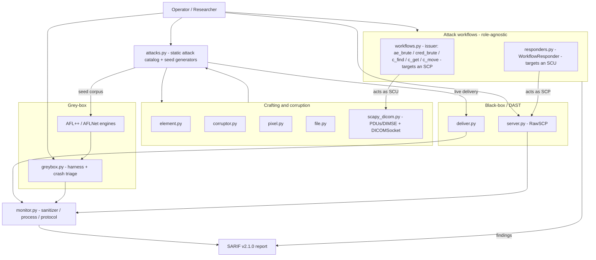

# C-SCARE

**DICOM Security Testing Framework** — black-box DAST, grey-box fuzzing, and scripted pentest workflows for DICOM implementations.

C-SCARE surgically crafts malformed DICOM files, datasets, and network traffic to probe PACS servers, viewers, and medical-device software.

## Capabilities at a glance

Three pillars, each documented in its own guide. The matrix below quantifies what ships today and where each capability lives.

|                       | **Pentest workflows** | **DAST** (black-box) | **Fuzzing** (grey-box) |
|-----------------------|-----------------------|----------------------|------------------------|
| **What it does**      | Scripted recon → query/retrieve flows that reach a test's starting state | Deliver a static attack catalog at a live target, watch for anomalies | Coverage-guided mutation of instrumented binaries |
| **Quantified**        | **5** workflows (W1–W5) | **8** attack categories · **68** payloads · **13** CVEs | **6** targets · **2** engines · **3** sanitizers |
| **Targets**           | SCP and SCU | SCP (server) and SCU (client, via rogue server) | SCP (file/parser/network) and SCU (experimental) |
| **Instrumentation**   | None | None — works on real devices / prebuilt binaries | Required (recompiled, QEMU, or SAND) |
| **Engine**            | C-SCARE (`DICOMSocket`) | C-SCARE (catalog + monitors) | AFL++ / AFLNet (C-SCARE bridges + triages) |
| **CLI**               | `c-scare wf …` | `c-scare --ip … --category …` / `c-scare rogue …` | `c-scare greybox run / triage …` |
| **Output**            | Classified findings | SARIF v2.1.0 | SARIF v2.1.0 |
| **Guide**             | [docs/workflows.md](docs/workflows.md) | [docs/dast.md](docs/dast.md) | [docs/fuzzing.md](docs/fuzzing.md) |

### Role × method matrix

C-SCARE is organised around *who* you test (a DICOM server / SCP, or a client / SCU) and *how* (black-box DAST, or grey-box fuzzing):

|                  | **Black-box — DAST**                                                                 | **Grey-box — fuzzing**                                                              |
|------------------|--------------------------------------------------------------------------------------|-------------------------------------------------------------------------------------|
| **SCP** (server) | Deliver the attack catalog live at a server, watch for protocol/health anomalies — `c-scare --ip … --category …` | Seed AFL++/AFLNet, fuzz instrumented DCMTK binaries, triage crashes — `c-scare greybox …` |
| **SCU** (client) | `RawSCP` rogue server feeds malformed responses to a connecting client — `c-scare rogue …` | Instrument a DICOM client (DCMTK `storescu`) and AFL-fuzz the server-response stream via a desock shim — `c-scare greybox run scu` (experimental) |

> **C-SCARE does not contain a fuzzing engine.** The mutation loop and coverage feedback belong to AFL++ (file targets) and AFLNet (network targets); C-SCARE crafts, corrupts, seeds, monitors, and triages around them. See [docs/architecture.md](docs/architecture.md) for what C-SCARE is — and is not.

## Architecture



See [docs/architecture.md](docs/architecture.md) for the module-by-module reference.

## Quick start

C-SCARE is not published on PyPI — install it from source:

```bash
git clone https://github.com/tmart234/C-SCARE
cd C-SCARE
pip install -e .            # core install: pydicom + scapy
pip install -e ".[test]"    # also installs pytest + pynetdicom (test suite)
```

The grey-box fuzzing toolchain additionally needs the git submodules and a DCMTK build — see [docs/fuzzing.md](docs/fuzzing.md):

```bash
git submodule update --init   # AFL++, AFLNet, DCMTK
scripts/build_dcmtk.sh        # build DCMTK (AFL++ afl-clang-fast + AFLNet afl-gcc, ASan)
```

Then pick a pillar:

```bash
# DAST — run the attack catalog against a live server
c-scare --ip 127.0.0.1 --port 4242 --ae-title ORTHANC --category cve --sarif cve.sarif

# Pentest workflow — brute Called AE Titles and read each accepted AET's AC payload (W1)
c-scare wf --ip 127.0.0.1 --port 4242 ae-brute --aets PACS,RADIOLOGY_BACKUP_2017

# Grey-box fuzzing — drive AFL++ against dcm2pnm
c-scare greybox run file
```

(`python -m c_scare …` is equivalent to the `c-scare` console command.)

## Documentation

| Guide | Contents |
|-------|----------|
| [docs/dast.md](docs/dast.md) | Black-box DAST — attack catalog (8 categories / 68 payloads / 13 CVEs), corruptor & scapy crafting, live delivery, rogue server |
| [docs/workflows.md](docs/workflows.md) | Pentest workflows — W1–W5 issuer drivers, SCP-side responders |
| [docs/fuzzing.md](docs/fuzzing.md) | Grey-box fuzzing — DCMTK toolchain, targets, device parity, SAND mode, coverage, campaigns |
| [docs/architecture.md](docs/architecture.md) | What C-SCARE is/is not, dataflow, module reference |
| [PROTOCOL.md](PROTOCOL.md) | Byte-level DICOM structure (file format, data elements, PDUs, DIMSE, state machine) |

## License

GPL-2.0-only
