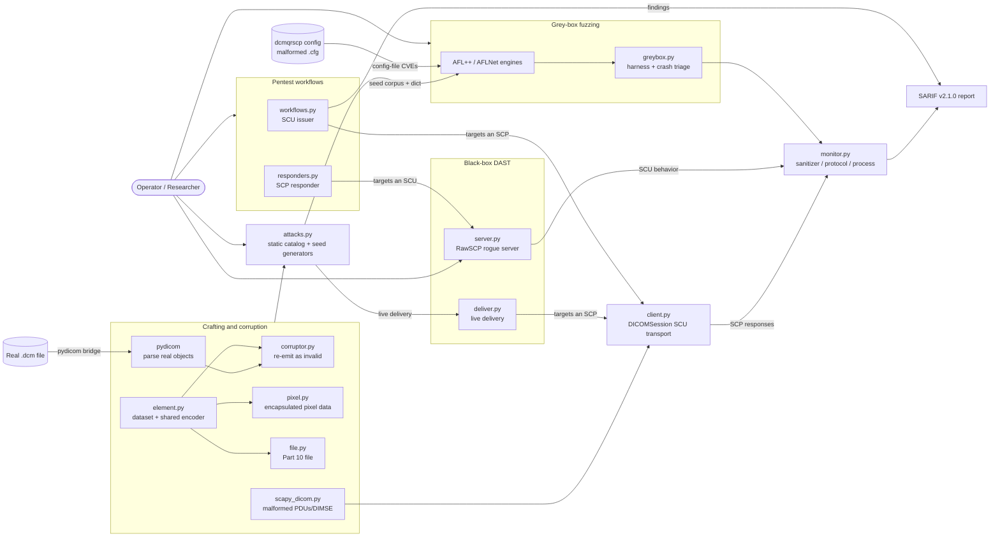

# C-SCARE

**DICOM Security Testing Framework** — black-box DAST, grey-box fuzzing, and scripted pentest workflows for DICOM implementations.

C-SCARE surgically crafts malformed DICOM files, datasets, and network traffic to probe PACS servers, viewers, and medical-device software.

## Capabilities at a glance

C-SCARE is organised around *who* you test — a DICOM server (SCP) or a client (SCU) — and *how* you test it: three pillars, each documented in its own guide. The matrix below quantifies what ships today, which role each pillar targets (see **Targets**), and where each capability lives.

|                       | **Pentest workflows** | **DAST** (black-box) | **Fuzzing** (grey-box) |
|-----------------------|-----------------------|----------------------|------------------------|
| **What it does**      | Scripted recon → query/retrieve flows that reach a test's starting state | Deliver a static attack catalog at a live target, watch for anomalies | Coverage-guided mutation of instrumented binaries |
| **Quantified**        | **5** workflows (W1–W5) | **9** attack categories · **159** payloads · **30** CVEs reproduced (DCMTK, GDCM, Orthanc, pydicom, dcm4che) (+ inspired-by & config-file CVEs) | **6** targets · **2** engines · **3** sanitizers |
| **Targets**           | SCP and SCU | SCP (server) and SCU (client, via rogue server) | SCP (file/parser/network) and SCU (experimental) |
| **Instrumentation**   | None | None — works on real devices / prebuilt binaries | Required (recompiled, QEMU, or SAND) |
| **Engine**            | C-SCARE (scapy-based) | C-SCARE (scapy-based via catalog + monitors) | AFL++ / AFLNet (C-SCARE bridges + triages) |
| **CLI**               | `c-scare wf …` | `c-scare --ip … --category …` / `c-scare rogue …` | `c-scare greybox run / triage …` |
| **Output**            | SARIF v2.1.0 | SARIF v2.1.0 | SARIF v2.1.0 |
| **Guide**             | [docs/workflows.md](docs/workflows.md) | [docs/dast.md](docs/dast.md) | [docs/fuzzing.md](docs/fuzzing.md) |

> **Note:** C-SCARE is not a fuzzing engine — AFL++ and AFLNet own the mutation loop; C-SCARE supplies the crafting, attack catalog, rogue server, grey-box bridge, and monitors around them.

## Architecture

The flow is left-to-right: external **inputs** feed the **crafting** layer, which
feeds the **attack catalog**, which fans out to the **three testing pillars**,
which drive the **targets** and converge on a single **SARIF** report.



### Module reference

A per-module breakdown of the `c_scare` package lives in [c_scare/README.md](c_scare/README.md).

## Quick start

C-SCARE is not published on PyPI — install it from source:

```bash
git clone https://github.com/tmart234/C-SCARE
cd C-SCARE
pip install -e .            # core install: pydicom + scapy
pip install -e ".[test]"    # also installs pytest + pynetdicom (test suite)
```

The grey-box fuzzing toolchain additionally needs the git submodules and a DCMTK build — see [docs/fuzzing.md](docs/fuzzing.md):

```bash
git submodule update --init   # AFL++, AFLNet, DCMTK
scripts/build_dcmtk.sh        # build DCMTK (AFL++ afl-clang-fast + AFLNet afl-gcc, ASan)
```

Then pick a pillar:

```bash
# DAST — run the attack catalog against a live server
c-scare --ip 127.0.0.1 --port 4242 --ae-title ORTHANC --category cve --sarif cve.sarif

# Pentest workflow — brute Called AE Titles and read each accepted AET's AC payload (W1)
c-scare wf --ip 127.0.0.1 --port 4242 ae-brute --aets PACS,RADIOLOGY_BACKUP_2017

# Grey-box fuzzing — drive AFL++ against dcm2pnm
c-scare greybox run file
```

(`python -m c_scare …` is equivalent to the `c-scare` console command.)

## License

GPL-2.0-only
