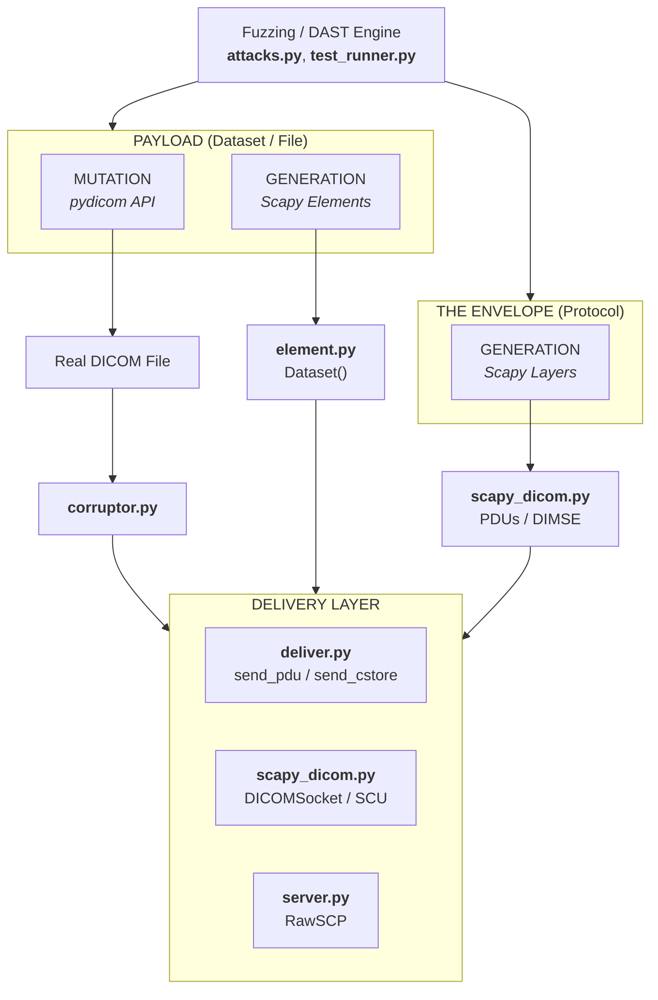

# C-SCARE

**DICOM Security Testing Framework** — fuzz, corrupt, and probe DICOM implementations at every layer of the stack.

C-SCARE lets you surgically craft malformed DICOM files, datasets, and network traffic to find vulnerabilities in PACS servers, viewers, and medical device software. It combines Scapy-based protocol fuzzing with pydicom-aware dataset corruption.

## Capabilities

- **Dataset corruption** — Modify VRs, lengths, values, and tag ordering in real DICOM files while keeping everything else valid (pydicom parses, our encoder corrupts)
- **Protocol fuzzing** — Craft and fuzz A-ASSOCIATE, P-DATA-TF, and DIMSE packets with full Scapy integration (`fuzz()`, `raw()`, layer stacking)
- **Pre-built attack patterns** — Parser attacks, memory attacks, logic/SSRF attacks, state machine violations, and CVE reproductions (2019–2024)
- **Rogue server** — `RawSCP` lets you fuzz DICOM *clients* by controlling exactly what bytes the server sends
- **Pixel data fuzzing** — Fragment-level control over encapsulated JPEG/JPEG2000/RLE with Scapy layers and a hybrid fuzzing pipeline
- **Corpus generation** — Output malformed `.dcm` files for AFL/libFuzzer/honggfuzz
- **CI-ready test runner** — `python -m c_scare` runs categorized tests against live DICOM servers

## Architecture



## Quick Start

### Install

```bash
pip install c_scare scapy pydicom  # pydicom is a hard dependency
```

### 1. Corrupt a real DICOM file

```python
import pydicom
from c_scare import Corruptor

ds = pydicom.dcmread("ct_scan.dcm")
c = Corruptor(ds)
c.set_vr(0x00100010, 'XX')              # Invalid VR
c.set_length(0x00100020, 0xFFFFFFFF)     # Lie about length
c.duplicate(0x00100010)                  # Duplicate tag (UAF trigger)

with open("corrupted.dcm", "wb") as f:
    f.write(c.to_file())
```

### 2. Fuzz the network protocol

```python
from c_scare.scapy_dicom import *
from scapy.packet import raw, fuzz

# Fuzzed association request
pdu = raw(fuzz(DICOM() / A_ASSOCIATE_RQ()))

# Full session
with DICOMSocket('192.168.1.100', 11112, 'PACS', 'ATTACKER') as sock:
    if sock.associate({CT_IMAGE_STORAGE_SOP_CLASS_UID: [DEFAULT_TRANSFER_SYNTAX_UID]}):
        sock.c_store(dataset_bytes, sop_class_uid, sop_instance_uid, transfer_syntax)
        sock.release()
```

### 3. Run pre-built attacks against a server

```bash
# All categories
python -m c_scare --ip 127.0.0.1 --port 4242 --ae-title ORTHANC

# Specific category
python -m c_scare --ip 127.0.0.1 --port 4242 --ae-title ORTHANC --category cve

# Generate fuzzing corpus
python -m c_scare --generate-corpus ./corpus --category parser
```

### 4. Fuzz DICOM clients with a rogue server

```python
from c_scare import RawSCP, ConnectionState
from c_scare.scapy_dicom import DICOM, A_ASSOCIATE_AC, A_ABORT
from scapy.packet import raw

scp = RawSCP(port=11112)

@scp.on_associate_rq
def handle(conn, pdu_bytes, pkt):
    return raw(DICOM() / A_ASSOCIATE_AC(protocol_version=0xFFFF))

@scp.on_state(ConnectionState.ASSOCIATED)
def on_associated(conn):
    conn.inject(raw(DICOM() / A_ABORT()))

scp.start()
```

## Attack Categories

| Category | What it targets | Key classes |
|----------|----------------|-------------|
| **Parser** | VR fuzzing, length mismatches, sequence bombs, format strings | `ParserAttacks` |
| **Protocol** | PDU malformation, AE title overflow, missing items | `ProtocolAttacks` |
| **Memory** | Pixel dimension overflow, fragment bombs, LUT overflow | `MemoryAttacks` |
| **Logic** | Transfer syntax mismatch, SSRF via URI, file:// injection | `LogicAttacks` |
| **State Machine** | Out-of-order PDUs (Sta1–Sta13 violations) | `StateMachineAttacks` |
| **CVE** | CVE-2023-32135, CVE-2024-24793/94, CVE-2024-33606, CVE-2019-11687, and more | `CVEAttacks` |

## Module Reference

| Module | Purpose |
|--------|---------|
| `element.py` | Dataset/Element building with Scapy-style `/` chaining |
| `corruptor.py` | Pydicom bridge — read with pydicom, corrupt with our encoder |
| `pixel.py` | Encapsulated pixel data with fragment-level control + Scapy layers |
| `file.py` | Part 10 file handling (preamble, meta header, transfer syntax via `pydicom.uid.UID`) |
| `scapy_dicom.py` | Full protocol stack — PDUs, DIMSE-C/N, `DICOMSocket` |
| `server.py` | `RawSCP` rogue server for fuzzing clients |
| `attacks.py` | Pure payload generators — all classes expose `all()` iterators yielding `AttackResult` |
| `deliver.py` | Network delivery — `send_pdu()`, `send_sequence()`, `send_cstore()` |
| `test_runner.py` | CLI test runner (`python -m c_scare`) |

## Protocol Reference

See [PROTOCOL.md](PROTOCOL.md) for byte-level DICOM structure (file format, data elements, PDUs, DIMSE commands, state machine).

## License

GPL-2.0-only