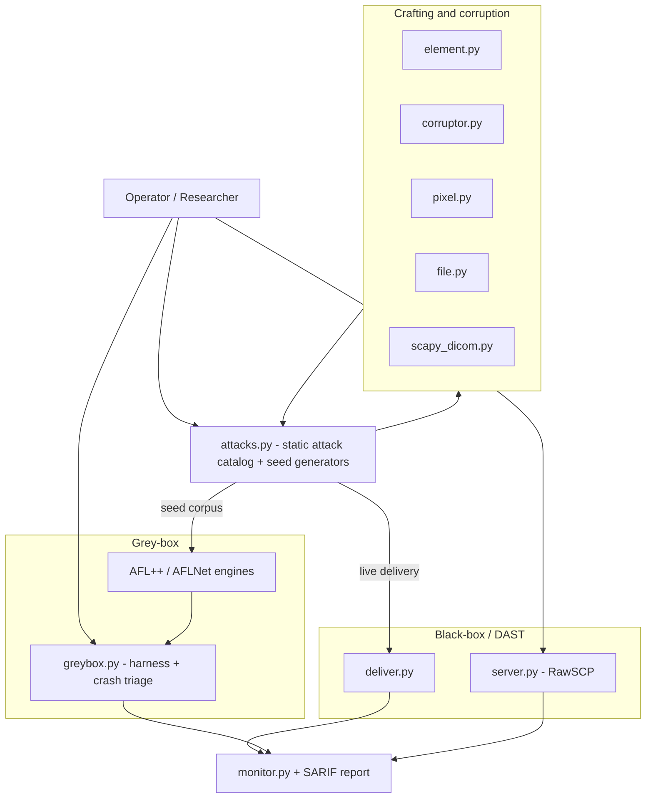

# C-SCARE

**DICOM Security Testing Framework** — black-box DAST and grey-box fuzzing for DICOM implementations.

C-SCARE surgically crafts malformed DICOM files, datasets, and network traffic to probe PACS servers, viewers, and medical-device software. It is organised around a **role × method matrix** — *who* you test (a DICOM server / SCP, or a client / SCU) and *how* (black-box DAST, or grey-box fuzzing):

|                  | **Black-box — DAST**                                                                 | **Grey-box — fuzzing**                                                              |
|------------------|--------------------------------------------------------------------------------------|-------------------------------------------------------------------------------------|
| **SCP** (server) | Deliver the attack catalog live at a server, watch for protocol/health anomalies — `c-scare --ip … --category …` | Seed AFL++/AFLNet, fuzz instrumented DCMTK binaries, triage crashes — `c-scare greybox …` |
| **SCU** (client) | `RawSCP` rogue server feeds malformed responses to a connecting client — `c-scare rogue …` | Instrument a DICOM client (DCMTK `storescu`) and AFL-fuzz the server-response stream via a desock shim — `c-scare greybox run scu` (experimental) |

### What C-SCARE is — and is not

C-SCARE **does not contain a fuzzing engine.** The mutation loop and coverage feedback belong to **AFL++** (file targets) and **AFLNet** (network targets). C-SCARE provides the parts around them:

- **Crafting & corruption** — `Corruptor` parses a real `.dcm` with pydicom and re-emits it *invalid* (pydicom alone cannot write malformed files); `scapy_dicom` crafts malformed PDUs/DIMSE that a compliant library refuses to send.
- **A static attack catalog** — ~50 hand-built payloads (parser, protocol, memory, logic, state-machine, CVE) used two ways: delivered live for black-box DAST, or written to disk as an AFL/AFLNet **seed corpus**.
- **Seed generators** — `ProtocolSeedGenerator` / `TargetedSeedGenerator` emit varied seeds for that corpus. They are *not* fuzzers — there is no mutation loop.
- **Rogue server** — `RawSCP` fuzzes DICOM *clients* by controlling exactly what bytes the server sends.
- **Grey-box bridge** — `greybox` launches the AFL++/AFLNet harnesses and triages their crashes into SARIF.
- **Monitoring & reporting** — sanitizer / protocol / process-health monitors and SARIF v2.1.0 output.

## Architecture



## Quick Start

### Install

C-SCARE is not published on PyPI — install it from source:

```bash
git clone https://github.com/tmart234/C-SCARE
cd C-SCARE
pip install -e .            # core install: pydicom + scapy
pip install -e ".[test]"    # also installs pytest + pynetdicom (test suite)
```

The grey-box fuzzing toolchain additionally needs the git submodules and a
DCMTK build (see [Grey-box fuzzing](#dcmtk-fuzzing-toolchain) below):

```bash
git submodule update --init   # AFL++, AFLNet, DCMTK
scripts/build_dcmtk.sh        # build DCMTK (AFL++ afl-clang-fast + AFLNet afl-gcc, ASan)
```

### 1. Corrupt a real DICOM file

```python
import pydicom
from c_scare import Corruptor

ds = pydicom.dcmread("ct_scan.dcm")
c = Corruptor(ds)
c.set_vr(0x00100010, 'XX')              # Invalid VR
c.set_length(0x00100020, 0xFFFFFFFF)     # Lie about length
c.duplicate(0x00100010)                  # Duplicate tag (UAF trigger)

with open("corrupted.dcm", "wb") as f:
    f.write(c.to_file())
```

### 2. Fuzz the network protocol

```python
from c_scare.scapy_dicom import *
from scapy.packet import raw, fuzz

# Fuzzed association request
pdu = raw(fuzz(DICOM() / A_ASSOCIATE_RQ()))

# Full session
with DICOMSocket('192.168.1.100', 11112, 'PACS', 'ATTACKER') as sock:
    if sock.associate({CT_IMAGE_STORAGE_SOP_CLASS_UID: [DEFAULT_TRANSFER_SYNTAX_UID]}):
        sock.c_store(dataset_bytes, sop_class_uid, sop_instance_uid, transfer_syntax)
        sock.release()
```

### 3. Black-box DAST — run the attack catalog against a server

```bash
# All categories against a live DICOM server
c-scare --ip 127.0.0.1 --port 4242 --ae-title ORTHANC

# A single category, with a SARIF report
c-scare --ip 127.0.0.1 --port 4242 --ae-title ORTHANC --category cve --sarif cve.sarif

# Generate an AFL++/AFLNet seed corpus
c-scare corpus -o ./corpus
```

(`python -m c_scare …` is equivalent to the `c-scare` console command.)

### 4. Fuzz DICOM clients with a rogue server

```python
from c_scare import RawSCP, ConnectionState
from c_scare.scapy_dicom import DICOM, A_ASSOCIATE_AC, A_ABORT
from scapy.packet import raw

scp = RawSCP(port=11112)

@scp.on_associate_rq
def handle(conn, pdu_bytes, pkt):
    return raw(DICOM() / A_ASSOCIATE_AC(protocol_version=0xFFFF))

@scp.on_state(ConnectionState.ASSOCIATED)
def on_associated(conn):
    conn.inject(raw(DICOM() / A_ABORT()))

scp.start()
```

### 5. Grey-box fuzzing — drive AFL++/AFLNet and triage crashes

```bash
# Launch a fuzz harness (AFL++/AFLNet own the mutation loop)
c-scare greybox run file              # fuzz dcm2pnm via AFL++
c-scare greybox run net-storescp      # fuzz storescp via AFLNet

# Triage the crashes a campaign produced into a SARIF report
c-scare greybox triage fuzz/out/file \
    --binary fuzz/build-llvm/bin/dcm2pnm --arg @@ --arg /tmp/out.pnm \
    --sarif crashes.sarif
```

## Attack Categories

| Category | What it targets | Key classes |
|----------|----------------|-------------|
| **Parser** | VR fuzzing, length mismatches, sequence bombs, format strings | `ParserAttacks` |
| **Protocol** | PDU malformation, AE title overflow, missing items | `ProtocolAttacks` |
| **Memory** | Pixel dimension overflow, fragment bombs, LUT overflow | `MemoryAttacks` |
| **Logic** | Transfer syntax mismatch, SSRF via URI, file:// injection | `LogicAttacks` |
| **Command Injection** | Shell metacharacters in SOP/Study Instance UID & Patient Name that feed storescp's `--exec-on-reception` placeholders (DCMTK #1194 / CVE-2026-5663) | `CommandInjectionAttacks` |
| **Path Traversal** | `../` sequences in SOP/Study Instance UID & Patient Name that escape the storescp/SCU storage directory (CVE-2022-2119/2120) | `PathTraversalAttacks` |
| **State Machine** | Out-of-order PDUs (Sta1–Sta13 violations) | `StateMachineAttacks` |
| **CVE** | CVE-2023-32135, CVE-2024-24793/94, CVE-2024-33606, CVE-2019-11687, and more | `CVEAttacks` |

## Module Reference

| Module | Purpose |
|--------|---------|
| `element.py` | Dataset/Element building with Scapy-style `/` chaining |
| `corruptor.py` | pydicom bridge — read with pydicom, re-emit *invalid* with our encoder |
| `pixel.py` | Encapsulated pixel data with fragment-level control + Scapy layers |
| `file.py` | Part 10 file handling (preamble, meta header, transfer syntax via `pydicom.uid.UID`) |
| `scapy_dicom.py` | DICOM crafting engine — PDUs, DIMSE-C/N, `DICOMSocket`; crafts malformed traffic |
| `server.py` | `RawSCP` rogue server for fuzzing clients (SCU) |
| `attacks.py` | Static attack catalog + seed generators — classes expose `all()` iterators of `AttackResult` |
| `deliver.py` | Black-box delivery — `send_pdu()`, `send_sequence()`, `send_cstore()` |
| `greybox.py` | Grey-box bridge — launches AFL++/AFLNet harnesses, triages crashes to SARIF |
| `monitor.py` | Crash/anomaly detection — sanitizer, protocol and process-health monitors |
| `test_runner.py` | CLI (`c-scare` / `python -m c_scare`) |

## Protocol Reference

See [PROTOCOL.md](PROTOCOL.md) for byte-level DICOM structure (file format, data elements, PDUs, DIMSE commands, state machine).

## DCMTK Fuzzing Toolchain

This is the **grey-box** half of the matrix. The `fuzz/` tree and `scripts/` shell harnesses run AFL++ / AFLNet — the actual fuzzing engines — against DCMTK binaries. C-SCARE supplies the seed corpus (`c-scare corpus`), the dictionary, the harnesses, and crash triage (`c-scare greybox triage`); AFL++/AFLNet own the mutation loop and coverage feedback. For coverage and campaign reporting see `scripts/coverage.sh` and `scripts/campaign.sh` below.

Grey-box targets (`scripts/campaign.sh <target>` / `c-scare greybox run <target>`):

| Target | Binary | Quadrant |
|--------|--------|----------|
| `file` | `dcm2pnm` | SCP grey-box — file + pixel pipeline (AFL++) |
| `parse` | `dcmdump` | SCP grey-box — dataset/element parser (AFL++) |
| `net-storescp` / `net-dcmrecv` / `net-dcmqrscp` | `storescp` / `dcmrecv` / `dcmqrscp` | SCP grey-box — network (AFLNet) |
| `scu` | `storescu` | SCU grey-box — client response parser (AFL++ + desock, experimental) |

### Fuzzing a custom DICOM binary

The harnesses default to DCMTK's stock tools, but the framework targets any DICOM binary:

- **Black-box** — point `c-scare --ip … --port …` (DAST) or `c-scare rogue` at your live service. No build access or instrumentation needed; works against a real device, a container, or a vendor-prebuilt binary.
- **Grey-box** — coverage-guided fuzzing needs the target instrumented. Two ways to get that:
  - *Recompiled instrumentation (fast)* — build your binary **and its `.so` dependencies** with the AFL compiler wrappers (`$AFLPP_PATH/afl-clang-fast` or `afl-gcc`, see `scripts/install_afl.sh`). Fastest fuzzing; requires source/build access.
  - *QEMU mode (no recompile)* — `scripts/fuzz_qemu.sh <binary> [args…]` runs `afl-fuzz -Q`, instrumenting at runtime. It fuzzes vendor-prebuilt binaries — the official DCMTK 3.6.7 release, or your own `.so`-backed binaries — with **no recompilation**, ~2-5× slower. Use this when rebuilding the target is impractical.
  - *File / parser path*: if your binary has no standalone file mode, copy `fuzz/harness/parse_harness.c`, wire in your parse entry point, and fuzz it with AFL++.
  - *Network path*: AFLNet's `-P DICOM` parser drives any DICOM listener — adapt `scripts/fuzz_net.sh` to your binary's launch command.

### Device parity (READ THIS)

The fuzz build must match the device's DCMTK source rev and build flags or the results don't reflect device behaviour. By default `scripts/build_dcmtk.sh` uses the upstream submodule at `fuzz/dcmtk/`. Override these env vars to point at the device build:

| Env var            | Purpose                                                                          |
|--------------------|----------------------------------------------------------------------------------|
| `DCMTK_SRC_DIR`    | Absolute path to operator-supplied DCMTK source. Submodule and `DCMTK_REF` ignored when set. |
| `DCMTK_REF`        | Git ref/tag/SHA inside the submodule. Default `DCMTK-3.6.7`. Ignored if `DCMTK_SRC_DIR` set. |
| `OPT_LEVEL`        | Compiler optimization (default `-O1`). Set to match the device build.            |
| `EXTRA_CFLAGS`     | Appended to `CFLAGS`/`CXXFLAGS` verbatim — match device defines.                  |
| `EXTRA_CMAKE_ARGS` | Extra `-D...` CMake args (whitespace-separated) — match device DCMTK feature flags. |
| `SANITIZERS`       | Comma list: `address,undefined,memory`. Default `address`.                       |

Worked example (matching a hypothetical device build):

```bash
DCMTK_SRC_DIR=/opt/device-src/dcmtk \
  OPT_LEVEL=-O2 \
  EXTRA_CFLAGS="-DCSCARE_DEVICE_PARITY=1" \
  EXTRA_CMAKE_ARGS="-DDCMTK_WITH_OPENSSL=ON -DDCMTK_ENABLE_LFS=lfs64" \
  SANITIZERS=address,undefined \
  scripts/build_dcmtk.sh
```

`build_dcmtk.sh` produces two builds, one per fuzzing track: `fuzz/build-llvm/` (AFL++ `afl-clang-fast`, LLVM mode — `dcm2pnm` / `dcmdump` / `storescu`) and `fuzz/build-net/` (AFLNet `afl-gcc` — `storescp` / `dcmrecv` / `dcmqrscp`). The two AFL forks' instrumentation is not interchangeable, so each track is compiled with its own fuzzer's toolchain. Each build dir records a `build_manifest.txt` (DCMTK SHA, compiler version, flags, AFL fork SHAs); campaign reports (`scripts/campaign.sh`) embed the relevant manifest in `run.json`.

### Coverage measurement

A separate gcov-instrumented build replays the saturated corpus to produce an lcov HTML report and per-file summary. Vanilla `gcc --coverage` (no AFL, no ASAN) — AFL's forkserver instrumentation collides with `--coverage` flushing.

```bash
# Install lcov (preferred) or gcovr fallback:
apt-get install lcov          # primary
pip install gcovr             # fallback

scripts/build_dcmtk_cov.sh    # builds into fuzz/build-cov/
scripts/coverage.sh file      # replays fuzz/out/file/{queue,crashes}
# Report → fuzz/coverage/file/{lcov.info, summary.txt, html/index.html}
```

`coverage.sh` aborts if the gcov build SHA doesn't match the ASAN build SHA.

### Campaigns + saturation rule

`scripts/campaign.sh <target>` runs a fuzz harness to a documented stop rule and emits `fuzz/runs/<target>/<UTC-timestamp>/run.json` with provenance and metrics for the test report.

| Env var            | Default | Notes                                                          |
|--------------------|---------|----------------------------------------------------------------|
| `CAMPAIGN_HOURS`   | 24      | Hard wallclock cap. Sample range 24–72.                        |
| `SATURATION_HOURS` | 6       | Stop early if no new edges/paths for this long. Effective floor is `max(SATURATION_HOURS, CAMPAIGN_HOURS/10)`. |
| `POLL_SECONDS`     | 60      | Poll cadence on `fuzzer_stats`.                                 |

Targets: `file` (dcm2pnm), `parse` (dcmdump), `net-storescp`, `net-dcmrecv`, `net-dcmqrscp`, `scu` (storescu, experimental).

## License

GPL-2.0-only