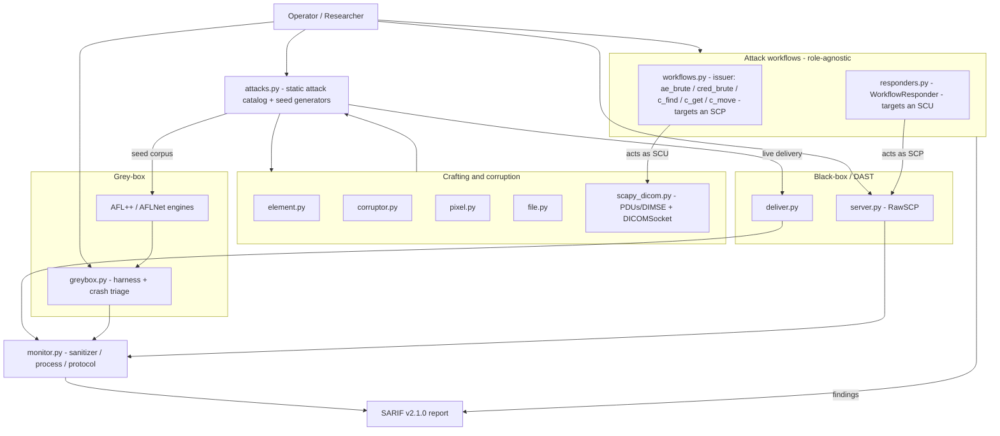

# Architecture & module reference

C-SCARE is organised around a **role × method matrix** — *who* you test (a
DICOM server / SCP, or a client / SCU) and *how* (black-box DAST, or grey-box
fuzzing) — plus a set of scripted [pentest workflows](workflows.md) that reach
the state a test should start from.

## What C-SCARE is — and is not

C-SCARE **does not contain a fuzzing engine.** The mutation loop and coverage
feedback belong to **AFL++** (file targets) and **AFLNet** (network targets).
C-SCARE provides the parts around them:

- **Crafting & corruption** — `Corruptor` parses a real `.dcm` with pydicom and
  re-emits it *invalid* (pydicom alone cannot write malformed files);
  `scapy_dicom` crafts malformed PDUs/DIMSE that a compliant library refuses to
  send.
- **A static attack catalog** — 68 hand-built payloads (parser, protocol,
  memory, logic, command injection, path traversal, state-machine, CVE) used
  two ways: delivered live for black-box [DAST](dast.md), or written to disk as
  an AFL/AFLNet **seed corpus**.
- **Seed generators** — `ProtocolSeedGenerator` / `TargetedSeedGenerator` emit
  varied seeds for that corpus. They are *not* fuzzers — there is no mutation
  loop.
- **Rogue server** — `RawSCP` fuzzes DICOM *clients* by controlling exactly
  what bytes the server sends.
- **Grey-box bridge** — `greybox` launches the AFL++/AFLNet harnesses and
  triages their crashes into SARIF.
- **Monitoring & reporting** — sanitizer / protocol / process-health monitors
  and SARIF v2.1.0 output.

## Dataflow

## Module reference

| Module | Purpose |
|--------|---------|
| `element.py` | Dataset/Element building with Scapy-style `/` chaining |
| `corruptor.py` | pydicom bridge — read with pydicom, re-emit *invalid* with our encoder |
| `pixel.py` | Encapsulated pixel data with fragment-level control + Scapy layers |
| `file.py` | Part 10 file handling (preamble, meta header, transfer syntax via `pydicom.uid.UID`) |
| `scapy_dicom.py` | DICOM crafting engine — PDUs, DIMSE-C/N, `DICOMSocket`; crafts malformed traffic |
| `server.py` | `RawSCP` rogue server for fuzzing clients (SCU) |
| `attacks.py` | Static attack catalog + seed generators — classes expose `all()` iterators of `AttackResult` |
| `workflows.py` | SCU-side attack workflows (issuer) — `ae_brute()`, `cred_brute()`, `build_query()`; query/retrieve flows (`c_find`/`c_get`/`c_move`) live on `DICOMSocket` |
| `responders.py` | SCP-side workflow responders (exercise an SCU client) — `accept_association()`, DIMSE RSP builders, `WorkflowResponder` |
| `deliver.py` | Black-box delivery — `send_pdu()`, `send_sequence()`, `send_cstore()` (optional `user_identity=` to authenticate first) |
| `greybox.py` | Grey-box bridge — launches AFL++/AFLNet harnesses, triages crashes to SARIF |
| `monitor.py` | Crash/anomaly detection — sanitizer, protocol and process-health monitors |
| `test_runner.py` | CLI (`c-scare` / `python -m c_scare`) |

## Protocol reference

See [PROTOCOL.md](../PROTOCOL.md) for byte-level DICOM structure (file format,
data elements, PDUs, DIMSE commands, state machine).
